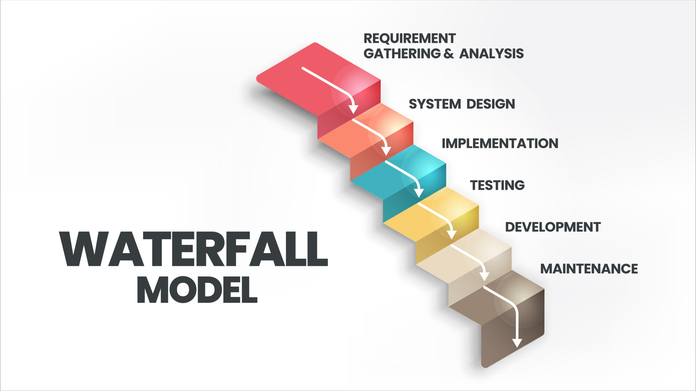
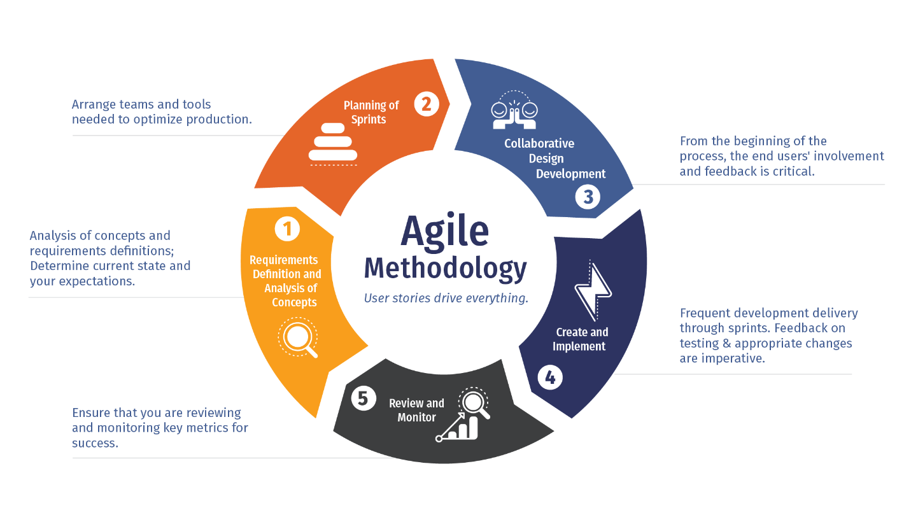

# What is DevOps ?

### **The Evolution of DevOps: Waterfall → Agile → DevOps**

The journey to DevOps was shaped by the challenges and inefficiencies faced in earlier software development methodologies. To understand **DevOps**, it's important to trace its roots through **Waterfall** and **Agile** methodologies. Each phase reflects improvements in software delivery processes to meet the demands of modern businesses.

---

### **1. Waterfall Model (The Traditional Approach)**

**What is it?**

The **Waterfall** methodology was the dominant software development process from the 1970s to the early 2000s. It follows a **linear, sequential approach** to software development.

### **Phases in Waterfall**

1. **Requirements** → Collect all requirements upfront.
2. **Design** → Plan and design the system based on requirements.
3. **Implementation** → Write the actual code.
4. **Testing** → Test the system to identify bugs.
5. **Deployment** → Release the software to production.
6. **Maintenance** → Address post-production issues.

### **Key Characteristics**

- Each phase **must be completed before moving** to the next.
- It is **rigid** with little room for changes once the process starts.
- Delivers a single, final product at the **end of the project**.

### **Limitations of Waterfall**

- **Slow Delivery**: Users receive the product only at the very end, sometimes after years.
- **Lack of Flexibility**: Changes in requirements late in the cycle are expensive and time-consuming.
- **Siloed Teams**: Developers, testers, and operations worked independently, leading to miscommunications.
- **No Continuous Feedback**: End-user feedback came too late in the process.

> Example: If a business requirement changed halfway through, the entire project might need to restart, causing delays and higher costs.
> 

---

### **2. Agile Methodology (The Revolution)**

**What is it?**

The **Agile** methodology emerged in the early 2000s as a response to Waterfall's shortcomings. It focuses on **iterative development, flexibility, and collaboration**.

### **Core Principles of Agile**

- **Iterative Development**: The product is delivered in smaller increments or “sprints.”
- **Collaboration**: Developers, testers, and stakeholders work closely together.
- **Continuous Feedback**: User feedback is incorporated in each sprint.
- **Flexibility**: Changes in requirements are welcomed, even late in the process.
- **Working Software**: Deliver functional software frequently, typically every 2-4 weeks.

### **Advantages of Agile**

- Faster delivery of **working software**.
- Easier to adapt to changing requirements.
- Promotes teamwork, communication, and collaboration.
- Encourages continuous improvement based on feedback.

> Example: Teams deliver a Minimum Viable Product (MVP) early, gather user feedback, and improve the product in the next sprint.
> 

---

### **3. DevOps (The Modern Approach)**

**What is it?**

DevOps takes Agile principles a step further by **integrating development and operations teams** to automate processes, enable faster delivery, and ensure stability.

### **Why DevOps Emerged**

While Agile improved development, there was still a **gap**:

- Agile focuses mainly on **development**.
- Operations teams (responsible for deployments, monitoring, and infrastructure) still worked separately.
- Frequent releases often caused operational **bottlenecks**.

This disconnect between **Development** and **Operations** caused delays, deployment failures, and post-release issues.

---

### **DevOps: The Convergence of Development and Operations**

### **Core Principles of DevOps**

1. **Automation**: Automate builds, testing, deployments, and infrastructure provisioning.
2. **Continuous Integration/Continuous Delivery (CI/CD)**: Deliver updates quickly, reliably, and frequently.
3. **Collaboration**: Developers and Operations work together, breaking down silos.
4. **Monitoring**: Continuous monitoring ensures rapid feedback and performance visibility.
5. **Infrastructure as Code (IaC)**: Manage infrastructure programmatically to ensure consistency.

### **How DevOps Works**

- **Plan** → Define requirements.
- **Develop** → Write code with version control (e.g., Git).
- **Build** → Use CI tools (e.g., Jenkins) to build and test code automatically.
- **Test** → Run automated tests.
- **Release** → Deploy code seamlessly using tools like Docker and Kubernetes.
- **Operate** → Monitor systems in production.
- **Feedback** → Gather insights for continuous improvement.

---

### **Key Improvements with DevOps**

| **Aspect** | **Waterfall** | **Agile** | **DevOps** |
| --- | --- | --- | --- |
| **Delivery Speed** | Slow (months/years) | Faster (weeks) | Rapid and Continuous |
| **Collaboration** | Siloed teams | Dev + Test Collaboration | Dev + Ops Collaboration |
| **Flexibility** | Rigid, hard to change | Flexible, iterative | Highly adaptable, automated |
| **Feedback Loop** | Late feedback | Continuous feedback | Real-time monitoring feedback |
| **Automation** | Minimal | Moderate | Extensive (CI/CD, IaC, Monitoring) |
| **Reliability** | High risk of failure | Improved reliability | High reliability and resilience |

---

### **Summary**

- **Waterfall**: A linear, sequential approach with rigid phases and slow delivery.
- **Agile**: An iterative, flexible approach improving speed and collaboration.
- **DevOps**: Combines Agile and Operations to enable automation, faster delivery, and reliability.

---

### **Real-Life Analogy**

- **Waterfall**: Building an entire house and showing it to the owner only at the end.
- **Agile**: Building one room at a time and asking for feedback before moving to the next.
- **DevOps**: Continuously building and testing the house, automating processes, and monitoring the construction to ensure there are no flaws.

## A piece of history

DevOps was founded by Patrick Debois and Andrew Clay in 2008. DevOps was founded by Andrew Clay and Patrick Debois in 2008. They advocate continuous development and delivery in an integrated DevOps. This is to address common problems with agile development such as decreased collaboration and longer project timelines. DevOps was born out of the realization that IT operations and software development were often isolated and had limited collaboration and communication. This resulted in slow, unreliable deployments, high failure rates, and a limited ability to adapt to changing customer requirements.

DevOps' initial focus was to improve the speed and reliability in software deployment by automating manual processes, and improving communication between operations and development teams. Continuous integration and delivery, infrastructure-as-code, and automation tools were all used to achieve this.

DevOps' scope has grown to encompass a wider variety of IT practices such as security, monitoring, logging and management of multi-cloud environments. DevOps is a critical component of digital transformation. It allows organizations to quickly respond to customer needs and compete in digital-first markets.

The phrase became popular after the DevOps Days event in early 2009. DevOps gained popularity with the publication of books such as The Phoenix Project, written by Gene Kim, George Spafford and Kevin Behr. The 2013 novel is narrative and portrays a fictional American company moving through a digital revolution. It also includes a chronology of DevOps’ development over time as well as significant events that shaped it.

DevOps has become a widely used tool in organizations of all sizes, across many industries. The DevOps approach to software development and delivery has changed the game. It focuses on collaboration, automation and continuous improvement. DevOps was first introduced in 2007-2008. Major corporations such as Adobe, Netflix, Amazon and Amazon now use the concept. After a steady rise, DevOps usage by enterprises jumped from 16% to 27% in 2014 to 2018.