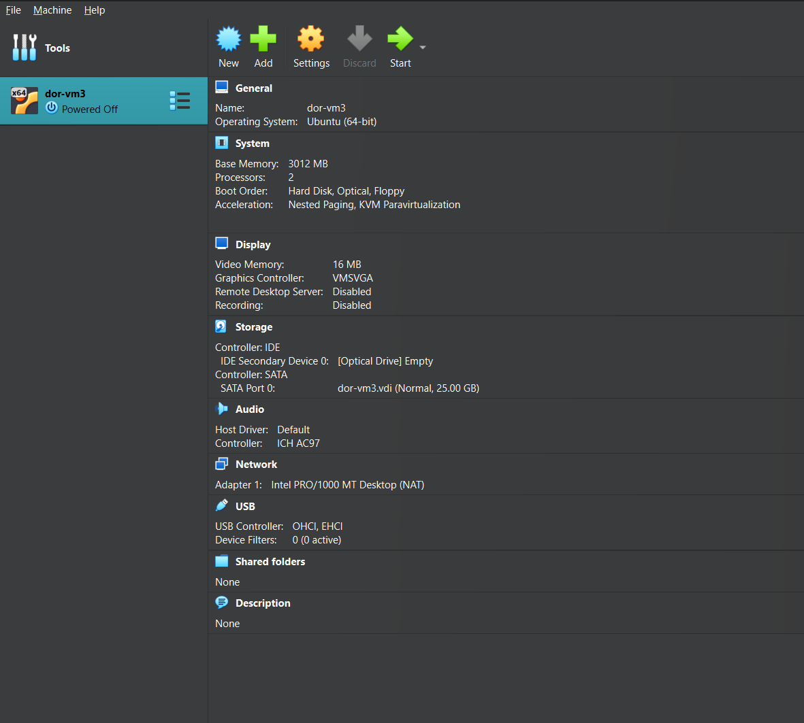
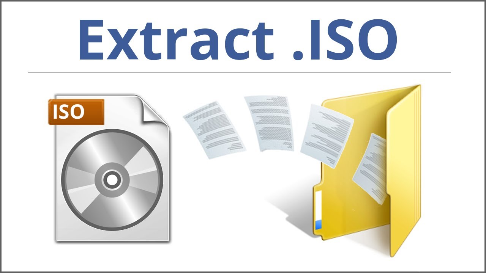

# **Virtualization**

### **Class on Virtualization**

---

### 1. **Concept Introduction: What is Virtualization?**

- **Definition:** Virtualization is the process of creating a virtual version of something, such as a computer, server, storage device, or network resource. Instead of running directly on physical hardware, virtualization allows multiple operating systems or applications to run on a single physical machine by dividing its resources.
- **Key Concept:** Think of virtualization as creating "virtual computers" within a single physical computer. Each virtual machine (VM) behaves as if it's a separate computer, even though they share the same physical resources.
- **Why It’s Important:** Virtualization helps in testing, development, and running multiple environments without requiring separate hardware. It’s a core technology for cloud computing, DevOps, and infrastructure automation.
- **Analogy:** Think of virtualization as renting out different rooms in a house. Each room represents a virtual machine (VM) running a different operating system, but they all share the same house (physical machine).

### Why is Virtualization Important in DevOps?

1. **Efficient Resource Utilization**
    
    Virtualization allows multiple VMs to run on a single physical server. This means you can maximize the use of hardware resources like CPU, memory, and storage.
    
2. **Environment Isolation**
    
    Each VM operates independently, which is crucial for creating isolated environments for development, testing, and production. This isolation prevents conflicts and ensures consistency.
    
3. **Scalability**
    
    With virtualization, you can quickly spin up or shut down environments, enabling scalability to meet the demands of a project or application.
    
4. **Cost Savings**
    
    By reducing the need for multiple physical machines, virtualization saves money on hardware, power, and maintenance.
    
5. **Disaster Recovery and Flexibility**
    
    Virtual machines can be backed up and restored easily. You can also move them across different physical machines with minimal downtime.
    
6. **Foundational for Cloud Computing**
    
    Most cloud platforms, like AWS and Azure, rely on virtualization. As a DevOps engineer, understanding virtualization helps you work seamlessly with cloud services.
    

---

### Introduction to VirtualBox

### **Learning Objectives:**

By the end of this section, students will be able to:

1. Understand what VirtualBox is and why it’s used.
2. Install and configure VirtualBox on their systems.
3. Create, manage, and interact with virtual machines.
4. Use VirtualBox for creating isolated environments for development and testing.

---

### **What is VirtualBox?**

**Definition:**

VirtualBox is a free, open-source Type 2 hypervisor developed by Oracle that allows users to create and manage virtual machines (VMs) on their existing operating systems.

**Why Use VirtualBox in DevOps?**

- Provides an isolated environment for development and testing.
- Allows easy experimentation with different operating systems.
- Ideal for building a sandbox environment for practicing Linux, networking, and server configurations.

### **Deep Dive: How VirtualBox Works**

- **Host vs. Guest Operating Systems:**
    - **Host OS:** The operating system running directly on your machine (e.g., Windows, macOS, Linux).
    - **Guest OS:** The OS that runs inside VirtualBox (e.g., Ubuntu, Windows Server).

- **Virtual Machine (VM):** A VM is an emulation of a physical computer, meaning it acts like a standalone computer running an OS.
- **Key Components of VirtualBox:**
    - **Hypervisor:** This is the software layer that allows multiple operating systems to share the hardware.
    - **Virtual Disk (VDI/VMDK):** The file that represents the hard disk for the guest OS.
    - **Network Settings:** NAT, Bridged Networking, Host-Only Adapter, etc., for VM communication.
- **Benefits of Virtualization:**
    - Efficient resource utilization
    - Environment isolation
    - Cost savings (no need for multiple physical machines)

### **Real-Life Use Cases**

- **Use Case 1: Testing and Development** – Developers and DevOps engineers often use VMs to test software in different environments (e.g., testing an application on Ubuntu, CentOS, and Windows simultaneously).
- **Use Case 2: Server Consolidation** – Instead of running multiple servers, organizations can virtualize multiple operating systems on a single server to save on hardware costs.
- **Use Case 3: Learning and Experimentation** – VirtualBox is great for setting up isolated environments for learning new technologies (e.g., setting up a Linux environment on a Windows laptop).

---

### **Steps to Install VirtualBox**

1. **Download VirtualBox:**
    - Go to the official website: VirtualBox Downloads.
        - https://www.virtualbox.org/
    - Select the appropriate version for your operating system (Windows, macOS, Linux).
2. **Install VirtualBox:**
    - Run the installer.
    - Follow the prompts to complete the installation.
3. **Verify Installation:**
    - Open VirtualBox from your applications menu or terminal.
    - Check the version in the VirtualBox Manager.

### **Optional: Install the Extension Pack**

The VirtualBox Extension Pack adds extra features like USB 2.0/3.0 support, remote desktop access, and host webcam passthrough.

- Download the extension pack from the VirtualBox website.
- In VirtualBox, go to **File > Preferences > Extensions**, and add the extension pack.

---

## **Tour in Virtualbox**

---

### **What is an ISO File?**

An **ISO file** (or ISO image) is a digital replica of the contents of a physical disk, such as a CD, DVD, or Blu-ray. It contains all the data and file structure from the original disk, packed into a single file.

### **Why ISO Files Are Important:**

- ISO files are commonly used to distribute operating systems.
- They can be mounted or burned onto a physical disk or used directly in virtualization software like VirtualBox.
- They allow you to boot a virtual machine or computer with the operating system contained in the ISO file.

---

### **How ISOs Are Used in VirtualBox**

When creating a virtual machine (VM), you can use an ISO file as the virtual CD/DVD from which the VM can boot and install the operating system. Think of the ISO as a "digital installation disk" for your virtual machine.

### **Where to Get OS Images (ISO Files)**

You can download ISO files for operating systems from their official websites or trusted sources. Below are examples of common OS distributions:

### **1. Linux Distributions (Free and Open Source)**

- **Ubuntu:**
    - Website: https://ubuntu.com/download
    - Choose between Desktop (for GUI) or Server (for CLI-focused setups).