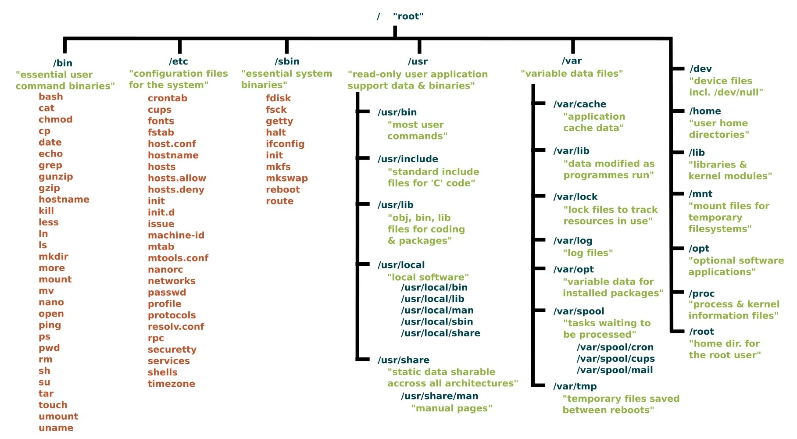

# Directories 



### **Linux Directories: Comprehensive Guide**

In Linux, directories are an essential part of the file system, used to organize files in a hierarchical structure. Understanding directories and their management is a fundamental skill for navigating and managing a Linux system.

---

### **1. What is a Directory in Linux?**

A **directory** in Linux is a special type of file that contains references (or pointers) to other files and directories. It acts like a folder, helping organize files into a logical structure.

---

### **2. Linux Directory Structure**

The Linux file system is organized as a tree, starting with the **root directory (`/`)**. All other directories and files branch off from this root.

### **Key Directories in Linux:**

| Directory | Purpose |
| --- | --- |
| `/` | Root directory. Everything in the Linux system starts here. |
| `/home` | Contains personal directories for users (e.g., `/home/dor`). |
| `/root` | Home directory for the root (superuser). |
| `/bin` | Contains essential binary programs (e.g., `ls`, `cat`, `mkdir`). |
| `/sbin` | Contains system administration binaries (e.g., `iptables`, `reboot`). |
| `/etc` | Configuration files for the system (e.g., network settings). |
| `/var` | Variable files like logs, caches, and spool data. |
| `/tmp` | Temporary files (automatically cleared on reboot). |
| `/usr` | User-related programs and utilities (e.g., `/usr/bin`). |
| `/opt` | Optional software packages. |
| `/dev` | Device files for hardware (e.g., `disk`, `usb`, `tty`). |
| `/mnt` and `/media` | Mount points for external storage devices. |
| `/proc` | Virtual filesystem providing information about system processes. |

---

### **3. Navigating Directories**

### **Common Commands to Navigate Directories:**

1. **`pwd` (Print Working Directory):**
Displays the current directory you are in.
    
    ```bash
    pwd
    ```
    
2. **`ls` (List Directory Contents):**
Lists files and directories.
    - `ls -l`: Long format listing.
    - `ls -a`: Includes hidden files (starting with `.`).
    
    ```bash
    ls -
    ```
    
3. **`cd` (Change Directory):**
Move between directories.
    - `cd /path/to/directory`: Navigate to a specific directory.
    - `cd ..`: Move up one level.
    - `cd ~`: Go to your home directory.
    
    ```bash
    cd /home/dor
    ```
    
4. **`tree` (Optional Tool):**
Shows directories and files in a tree structure (requires installation).
    
    ```bash
    tree
    ```
    

---

### **4. Managing Directories**

### **Creating Directories: `mkdir`**

Creates a new directory.

- Basic usage:
    
    ```bash
    mkdir my_new_directory
    ```
    
- Create parent directories:
    
    ```bash
    
    mkdir -p parent/child/grandchild
    
    ```
    

### **Removing Directories: `rmdir` and `rm`**

- `rmdir`: Removes empty directories.
    
    ```bash
    
    rmdir empty_directory
    
    ```
    
- `rm -r`: Removes directories and their contents recursively.
    
    ```bash
    
    rm -r directory_name
    
    ```
    

### **Moving/Renaming Directories: `mv`**

- Rename a directory:
    
    ```bash
    
    mv old_name new_name
    
    ```
    
- Move a directory:
    
    ```bash
    
    mv directory_name /path/to/new_location
    
    ```
    

### **Copying Directories: `cp`**

- Copy a directory and its contents:
    
    ```bash
    
    cp -r source_directory destination_directory
    
    ```
    

---

### **5. Hidden Directories**

- Directories that start with a dot (`.`) are hidden.
Example: `.config`, `.ssh`
- View hidden directories using:
    
    ```bash
    
    ls -a
    
    ```
    

---

### **6. Permissions for Directories**

### **Understanding Permissions:**

Use `ls -l` to view directory permissions:

```bash

drwxr-xr-x  3 dor users 4096 Nov 19 14:00 my_directory

```

- **`d`**: Indicates a directory.
- **`rwxr-xr-x`**: Permissions for owner, group, and others.
    - `r` = Read
    - `w` = Write
    - `x` = Execute (needed to access the directory).

### **Changing Permissions:**

- Use `chmod` to modify permissions:
    
    ```bash
    chmod 755 my_directory
    
    ```
    
- Use `chown` to change ownership:
    
    ```bash
    chown dor:users my_directory
    
    ```
    

---

### **7. Useful Examples**

### Example 1: Create a Directory Tree

```bash
mkdir -p projects/python/flask_app
```

This creates a nested structure: `projects/python/flask_app`.

### Example 2: Copy a Directory

```bash
cp -r /home/dor/my_project /home/dor/backups/

```

Copies `my_project` into `backups`.

### Example 3: Find Directories

```bash
find / -type d -name "log"

```

Search for directories named `log` starting from the root.

---

### **8. Hands-On Lab**

### Lab Objective:

1. Create a directory structure for a project.
2. Set appropriate permissions.
3. Navigate and manage the directories.

### Steps:

1. Create a project directory:
    
    ```bash
    mkdir -p ~/projects/web_app/{frontend,backend,logs}
    
    ```
    
2. Verify the structure:
    
    ```bash
    tree ~/projects/web_app
    
    ```
    
3. Set permissions to allow only the owner to access:
    
    ```bash
    chmod 700 ~/projects/web_app/logs
    
    ```
    
4. Navigate to the `backend` directory:
    
    ```bash
    cd ~/projects/web_app/backend
    
    ```
    
5. Remove the `logs` directory:
    
    ```bash
    rm -r ~/projects/web_app/logs
    
    ```
    

---

### **9. Best Practices**

1. **Organize Smartly**: Use meaningful directory names to keep things clear.
2. **Avoid Too Many Nesting Levels**: Deep structures can be hard to navigate.
3. **Use Permissions Wisely**: Protect sensitive directories with proper permissions.
4. **Clean Up Regularly**: Remove unused directories to avoid clutter.