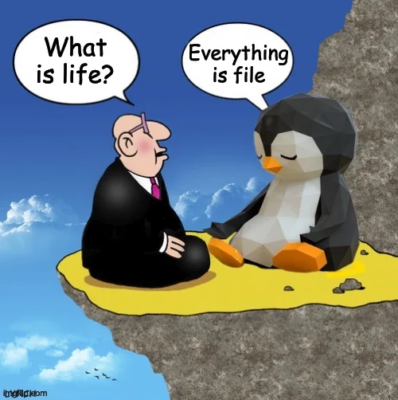
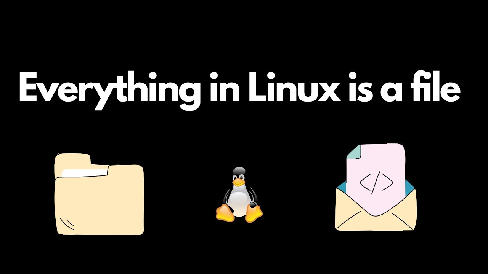

# Everything is a File !

### **Everything is a File in Linux**

In Linux, the concept **"everything is a file"** is a foundational philosophy that simplifies how the operating system manages hardware, software, and user interactions. This means almost everything in Linux—whether it's text, a device, a directory, or a system resource—is treated as a file.



## Now For Real - **What Does "Everything is a File" Mean?**



### **Key Idea**

In Linux:

1. **Regular Files**: Text files, images, executables, etc., are files.
2. **Directories**: Directories are special types of files that store references to other files.
3. **Devices**: Hardware like disks, printers, and terminals are represented as files.
4. **Processes**: Even running processes and system resources (like memory) can be accessed via files in special directories like `/proc` and `/sys`.

---

### **Why This Philosophy?**

1. **Uniformity**: Treating everything as a file creates a unified way to interact with all resources.
    - You can use the same commands (e.g., `read`, `write`, `open`) to interact with files, devices, and processes.
2. **Flexibility**: Makes Linux systems highly modular and extensible.
3. **Ease of Automation**: Shell scripts can work with devices or processes just like they work with regular files.

---

### **Types of Files in Linux**

Linux organizes files into **7 main types**, all accessible via the file system.

| **File Type** | **Description** | **Example** |
| --- | --- | --- |
| **Regular File** | Normal files like text, images, executables, or logs. | `/home/user/file.txt` |
| **Directory** | Special files that store information about other files. | `/home/user/` |
| **Device File** | Represents hardware devices (block or character devices). | `/dev/sda`, `/dev/tty` |
| **Symbolic Link** | Shortcut pointing to another file or directory. | `/home/user/shortcut -> /var` |
| **Socket** | Enables communication between processes (Inter-Process Communication or IPC). | `/var/run/docker.sock` |
| **Named Pipe (FIFO)** | File for processes to communicate in a producer-consumer model. | `/tmp/pipe` |
| **Special File** | Virtual files representing kernel or system information. | `/proc/cpuinfo`, `/sys/` |

---

### **Key Directories for "Everything is a File"**

1. **`/dev`**: Device Files
    - Every hardware device is represented as a file in `/dev`.
    - Example:
        - `/dev/sda` represents a hard disk.
        - `/dev/tty` represents a terminal.
    - You can read/write to these files to interact with devices:
        
        ```bash
        cat /dev/tty    # Reads input from the terminal
        ```
        
2. **`/proc`**: Process Information
    - A virtual filesystem containing details about running processes and system information.
    - Example:
        - `/proc/1/` contains details about the process with PID 1 (usually `init`).
        - `/proc/meminfo` provides memory usage information.
    - You can interact with system processes as files:
        
        ```bash
        cat /proc/cpuinfo  # View CPU details
        ```
        
3. **`/sys`**: Kernel and Hardware Interaction
    - Provides a view of hardware devices and kernel data.
    - Example:
        - `/sys/block/sda` gives details about the `sda` block device.
        - `/sys/class/net/eth0` contains info about the network interface.

---

### **Devices as Files**

Devices are represented as two types of special files:

1. **Character Devices**:
    - Data is transferred one character at a time.
    - Example: `/dev/tty` (terminal), `/dev/random`.
2. **Block Devices**:
    - Data is transferred in blocks (chunks).
    - Example: `/dev/sda` (hard drive).

### Example: Writing to a Device

```bash
echo "Hello, World!" > /dev/tty
```

This writes "Hello, World!" directly to the terminal.

---

### **Processes as Files**

The `/proc` directory represents processes as files.

- Each running process has a directory named by its PID (Process ID).
- Example: `/proc/1234/` contains information about process `1234`.

### Example: Reading Process Information

```bash
cat /proc/1234/status  # View status of process 1234
```

---

### **Interacting with Files**

The idea of "everything is a file" allows you to use standard file manipulation commands to interact with virtually anything on the system.

### Common Commands:

| Command | Use |
| --- | --- |
| `cat` | Read the contents of a file (e.g., `/proc/cpuinfo`). |
| `echo` | Write data to a file (e.g., `/dev/null`). |
| `ls` | List files and directories. |
| `stat` | View detailed information about a file. |
| `touch` | Create a new file. |

---

### **Advantages of "Everything is a File"**

1. **Simplicity**: A consistent way to interact with all resources.
2. **Interoperability**: Commands and programs can be reused for files, devices, and processes.
3. **Extensibility**: Easy to add new functionality (e.g., adding a virtual file in `/proc` for a new feature).

---

### **Hands-On Exercises**

### Exercise 1: Explore Device Files

1. List all files in `/dev`:
    
    ```bash
    ls /dev
    ```
    
2. View details of the terminal device:
    
    ```bash
    cat /dev/tty
    ```
    

### Exercise 2: Interact with the `/proc` Filesystem

1. View CPU information:
    
    ```bash
    cat /proc/cpuinfo
    ```
    
2. View memory usage:
    
    ```bash
    cat /proc/meminfo
    ```
    

### Exercise 3: Create and Use a Named Pipe

1. Create a named pipe:
    
    ```bash
    mkfifo my_pipe
    ```
    
2. In one terminal, read from the pipe:
    
    ```bash
    cat my_pipe
    ```
    
3. In another terminal, write to the pipe:
    
    ```bash
    echo "Hello, Linux!" > my_pipe
    ```
    

---

### **Conclusion**

The "everything is a file" concept in Linux simplifies the system’s design and management. By treating files, directories, devices, and processes uniformly, Linux provides a powerful and flexible way to interact with the operating system. This philosophy is one of the reasons Linux is so versatile and widely used in various domains, from servers to embedded systems.