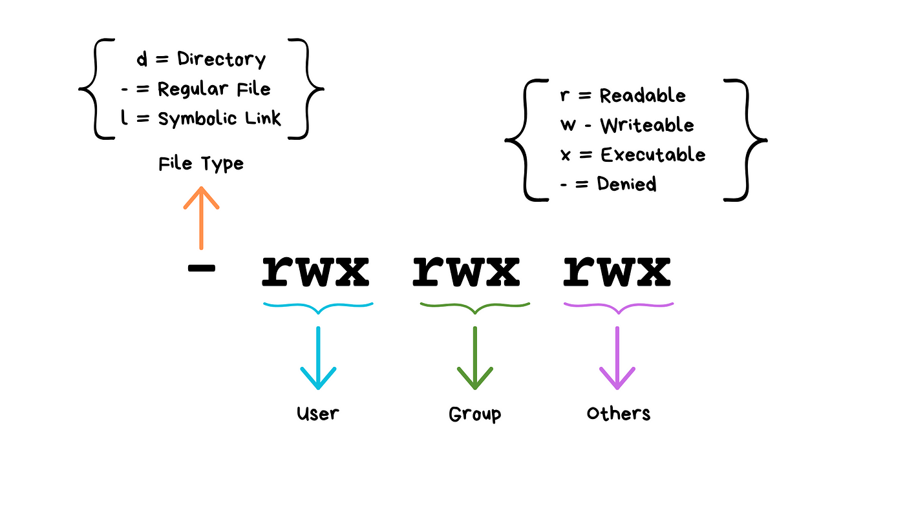

### **File Permissions in Linux**

---

### **1. Introduction**

File permissions in Linux are a fundamental concept that controls **who can access a file or directory** and **what actions they can perform** on it. Understanding file permissions is critical for system security and proper file management.

---

### **2. The Basics of File Permissions**

Each file and directory in Linux has three types of permissions and three categories of users:

### **Types of Permissions**

| Symbol | Meaning | Description |
| --- | --- | --- |
| `r` | Read | Allows viewing the contents of a file. |
| `w` | Write | Allows modifying the contents of a file. |
| `x` | Execute | Allows executing the file (if it’s a program/script) or accessing a directory. |

### **Categories of Users**

| User Category | Description |
| --- | --- |
| `Owner` | The user who owns the file. |
| `Group` | A group of users who share access rights. |
| `Others` | All other users on the system. |

---

### **3. Viewing File Permissions**

Use the `ls -l` command to view permissions:

```bash
ls -l
```

**Example Output:**

```bash
-rw-r--r-- 1 dor users 2048 Nov 19 15:00 file.txt

```

### Breakdown of the Output:

1. **`rw-r--r--`**: Permission string (explained below).
2. **`1`**: Number of hard links.
3. **`dor`**: Owner of the file.
4. **`users`**: Group associated with the file.
5. **`2048`**: File size in bytes.
6. **`Nov 19 15:00`**: Last modified date and time.
7. **`file.txt`**: File name.

### Understanding the Permission String:

```css
css
Copy code
-rw-r--r--

```

1. **First Character**: File type
    - `` for a regular file.
    - `d` for a directory.
    - `l` for a symbolic link.
2. **Next 9 Characters**: Permissions
    - Split into three groups: Owner (`rw-`), Group (`r--`), Others (`r--`).

---

### **4. Changing Permissions**

### **Using `chmod` Command**

The `chmod` command changes file permissions.

### **Symbolic Method**

- Modify permissions using `u` (owner), `g` (group), `o` (others), and `a` (all):
    - `+`: Add permission.
    - ``: Remove permission.
    - `=`: Set exact permission.

**Examples:**

1. Add execute permission for the owner:
    
    ```bash
    bash
    Copy code
    chmod u+x file.txt
    
    ```
    
2. Remove write permission for the group:
    
    ```bash
    bash
    Copy code
    chmod g-w file.txt
    
    ```
    
3. Set permissions for all users to read-only:
    
    ```bash
    bash
    Copy code
    chmod a=r file.txt
    
    ```
    

### **Numeric Method**

- Permissions are represented as numbers:
    - `4` = Read (`r`).
    - `2` = Write (`w`).
    - `1` = Execute (`x`).

**Calculate Permission Numbers:**

- Example: `rw-` = 4 + 2 = `6`, `r--` = 4.

**Examples:**

1. Set `rwx` for the owner, `r-x` for the group, and `r--` for others:
    
    ```bash
    bash
    Copy code
    chmod 754 file.txt
    
    ```
    
2. Remove all permissions for others:
    
    ```bash
    bash
    Copy code
    chmod 770 file.txt
    
    ```
    

---

### **5. Changing Ownership and Groups**

### **Using `chown` Command**

Change the owner of a file:

```bash
chown new_owner file.txt

```

Change the owner and group:

```bash
chown new_owner:new_group file.txt

```

### **Using `chgrp` Command**

Change the group of a file:

```bash
chgrp new_group file.txt

```

---

### **6. Special Permissions**

### **Setuid**

- Allows a program to run with the file owner's permissions.
- Example:
    
    ```bash
    bash
    Copy code
    chmod u+s file.txt
    
    ```
    

### **Setgid**

- Allows files in a directory to inherit the group of the directory.
- Example:
    
    ```bash
    bash
    Copy code
    chmod g+s directory_name
    
    ```
    

### **Sticky Bit**

- Prevents users from deleting files they don’t own in a shared directory.
- Example:
    
    ```bash
    bash
    Copy code
    chmod +t directory_name
    
    ```
    

---

### **7. Hands-On Practice**

### Task 1: View and Interpret Permissions

1. Create a file:
    
    ```bash
    bash
    Copy code
    touch example.txt
    
    ```
    
2. View its permissions:
    
    ```bash
    bash
    Copy code
    ls -l example.txt
    
    ```
    

### Task 2: Modify Permissions

1. Add execute permission for the owner:
    
    ```bash
    bash
    Copy code
    chmod u+x example.txt
    
    ```
    
2. Set permissions to `rwxr-x---` using numeric mode:
    
    ```bash
    bash
    Copy code
    chmod 750 example.txt
    
    ```
    

### Task 3: Change Ownership

1. Change the owner of `example.txt` to `root`:
    
    ```bash
    bash
    Copy code
    sudo chown root example.txt
    
    ```
    
2. Change the group of `example.txt` to `admin`:
    
    ```bash
    bash
    Copy code
    sudo chgrp admin example.txt
    
    ```
    

---

### **8. Quiz Questions**

1. What does the `x` permission allow for a directory?
2. How would you give read, write, and execute permissions to the owner, but only read and execute permissions to the group and others?
3. What command changes the group ownership of a file?

---

### **9. Key Takeaways**

- Permissions define what actions users can perform on files and directories.
- Use `chmod` to modify permissions, `chown` to change ownership, and `chgrp` to change group ownership.
- Understanding and managing permissions is crucial for securing a Linux system.