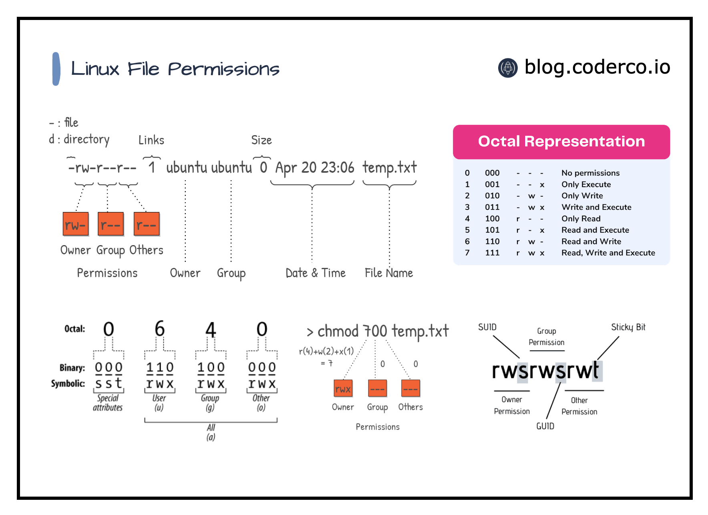

### **Introduction to File Permissions**

**Objective:**

By the end of this lecture, students will understand Linux file permissions, their importance, and how to manage them effectively.

---

### **1. Why File Permissions Are Important**

- **Definition:** File permissions control who can access or modify files and directories in a Linux system.
- **Why Use Permissions?**
    - Protect sensitive data from unauthorized access.
    - Enforce least privilege for users and applications.
    - Maintain system security and integrity.

---

### **2. Basic Concepts**

- **Ownership:**
    - **User (u):** The owner of the file (creator by default).
    - **Group (g):** A set of users who share file access.
    - **Others (o):** Everyone else on the system.
- **Permission Types:**
    - **Read (r):** View the file contents or list a directory.
    - **Write (w):** Modify the file contents or create/delete files in a directory.
    - **Execute (x):** Run a file (e.g., a script) or access a directory.

**Command:**

`ls -l` displays file details, including permissions.

Example Output:

```bash
-rwxr-xr-- 1 user group 4096 Jan  1 12:00 example.tx
```

- **Explanation:**
    - ``: Regular file (other types include `d` for directories, `l` for symbolic links, etc.).
    - `rwx`: Permissions for the owner.
    - `r-x`: Permissions for the group.
    - `r--`: Permissions for others.

---

### **3. Viewing and Understanding Permissions**

- **Command:** `ls -l`
- **Example:**
    
    ```bash
    -rw-r--r-- 1 user group 1024 Jan  1 12:00 notes.txt
    ```
    
    - **`rw-`:** The owner can read and write.
    - **`r--`:** Group members can only read.
    - **`r--`:** Others can only read.


---

### **4. Changing Permissions with `chmod`**

**Syntax:** `chmod [permissions] [file]`

- **Numeric Method (Octal):**
    - `4`: Read, `2`: Write, `1`: Execute.
    - Add values for combined permissions:
        - `7`: Full (rwx), `6`: Read and Write (rw-), etc.
    - Examples:
        
        ```bash
        chmod 755 script.sh  # rwxr-xr-x
        chmod 644 document.txt  # rw-r--r--
        ```
        
- **Symbolic Method:**
    - `u`: User, `g`: Group, `o`: Others.
    - `+`: Add permission, ``: Remove permission, `=`: Set exact permissions.
    - Examples:
        
        ```bash
        chmod u+x script.sh  # Add execute permission for user.
        chmod g-w file.txt  # Remove write permission for group.
        chmod o=rx public.txt  # Set read and execute for others.
        
        ```
        

---

### **5. Ownership with `chown`**

**Command:** `chown [user]:[group] [file]`

- Change the owner or group of a file.
- Examples:
    
    ```bash
    chown alice notes.txt  # Change owner to alice.
    chown alice:developers code.py  # Change owner to alice and group to developers.
    
    ```
    

---

### **Example 1: Basic Permissions on a Text File**

**Scenario:**

You want to create a file for storing passwords (not recommended for real security, but for learning) that only you can read and write to, while others have no access.

1. **Commands:**
    
    ```bash
    touch passwords.txt
    chmod 600 passwords.txt
    ls -l passwords.txt
    
    ```
    
2. **Expected Output:**
    
    ```bash
    -rw------- 1 user group 0 Jan  1 12:00 passwords.txt
    
    ```
    
3. **Explanation to Students:**
    - The `600` permission means:
        - User: Read and Write (`rw-`).
        - Group: No access (`--`).
        - Others: No access (`--`).
    - This setup ensures only you can access this file, demonstrating the importance of protecting sensitive data.

---

### **Example 2: Sharing Files in a Group**

**Scenario:**

You are collaborating with a team, and you want a directory where everyone in the group can create, modify, and delete files, but others outside the group cannot access it.

1. **Commands:**
    
    ```bash
    mkdir project_docs
    chmod 770 project_docs
    chown :developers project_docs
    ls -ld project_docs
    
    ```
    
2. **Expected Output:**
    
    ```bash
    drwxrwx--- 1 user developers 4096 Jan  1 12:00 project_docs
    
    ```
    
3. **Explanation to Students:**
    - The `770` permission means:
        - User: Full access (`rwx`).
        - Group: Full access (`rwx`).
        - Others: No access (`--`).
    - Changing the group to `developers` ensures only the designated team has access.
    - This approach is useful for team collaboration while maintaining privacy from other users.

---

### **Example 3: Using the Sticky Bit for Shared Directories**

- What is the Sticky Bit?
    
    The **Sticky Bit** is a special permission in Linux used mainly on directories. It ensures that **only the owner of a file or directory, or the root user, can delete or rename it**, even if others have write permissions.
    

**Scenario:**

You create a shared directory where users can add files, but they should not be able to delete each other's files.

1. **Commands:**
    
    ```bash
    mkdir shared_dir
    chmod 1777 shared_dir
    ls -ld shared_dir
    
    ```
    
2. **Expected Output:**
    
    ```bash
    drwxrwxrwt 1 user group 4096 Jan  1 12:00 shared_dir
    
    ```
    
3. **Explanation to Students:**
    - The `1777` permission means:
        - User, Group, Others: Full access (`rwx`).
        - Sticky Bit (`t`): Only the file creator can delete their files.
    - This is often used in `/tmp` directories to prevent accidental or malicious deletions in shared environments.

---

### Discussion Points

1. What potential risks exist if permissions are too relaxed (e.g., `777`)?
2. How does the sticky bit enhance security in shared directories?
3. Why might ACLs be preferable in complex scenarios with multiple users and groups?

---

### **8. When and Why to Use File Permissions**

- **Security:** Prevent unauthorized access to sensitive files.
- **Collaboration:** Share files with the right permissions in groups.
- **System Integrity:** Protect critical system files from accidental changes.
- **Automation:** Ensure scripts and executables have proper access controls.

---

