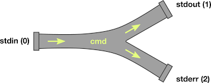

## File Redirections 



### **Lecture: Linux File Redirections**

---

### **1. Introduction**

In Linux, **file redirection** allows you to control the flow of data between commands and files. You can direct output to files, use files as input, and even handle error messages effectively. Redirection is a fundamental concept for managing input/output (I/O) in the shell.

---

### **2. Types of Redirections**

Linux provides three standard streams for I/O:

1. **Standard Input (stdin)**: Input to a command (`0`).
2. **Standard Output (stdout)**: Output from a command (`1`).
3. **Standard Error (stderr)**: Error messages (`2`).

---

### **3. Redirection Operators**

### **a) Output Redirection (`>` and `>>`)**

- **`>`**: Redirects and overwrites the output to a file.
- **`>>`**: Redirects and appends the output to a file.

**Examples:**

- Overwrite the file:
    
    ```bash
    echo "Hello, Linux!" > file.txt
    
    ```
    
- Append to the file:
    
    ```bash
    echo "Appending text" >> file.txt
    
    ```
    

### **b) Input Redirection (`<`)**

- Redirects input from a file to a command.

**Example:**

```bash
cat < file.txt

```

### **c) Error Redirection (`2>` and `2>>`)**

- Redirects error messages to a file.
- **`2>`**: Overwrites the file with errors.
- **`2>>`**: Appends errors to the file.

**Examples:**

- Save errors to a file:
    
    ```bash
    ls nonexistentfile 2> errors.log
    
    ```
    
- Append errors to a file:
    
    ```bash
    ls nonexistentfile 2>> errors.log
    
    ```
    

### **d) Redirecting Both stdout and stderr (`>&` or `|&`)**

- Combine standard output and error into one stream.
- **`>&`**: Redirect both streams to the same file.
- **`|&`**: Pipe both streams to another command (Bash 4+).

**Examples:**

- Redirect stdout and stderr to a file:
    
    ```bash
    command > output.log 2>&1
    
    ```
    
- Pipe stdout and stderr:
    
    ```bash
    command |& grep "error"
    
    ```
    

---

### **4. Advanced Redirection Techniques**

### **a) Discarding Output (`/dev/null`)**

- Redirect output you don’t want to keep to `/dev/null`.

**Examples:**

- Discard stdout:
    
    ```bash
    command > /dev/null
    
    ```
    
- Discard stderr:
    
    ```bash
    command 2> /dev/null
    
    ```
    
- Discard both:
    
    ```bash
    command > /dev/null 2>&1
    
    ```
    

### **b) Here Documents (`<<`)**

- Provide multiline input directly to a command.

**Example:**

```bash
cat <<EOF
This is a
multiline input
EOF

```

### **c) Here Strings (`<<<`)**

- Provide a string as input to a command.

**Example:**

```bash
grep "Linux" <<< "Hello, Linux World!"

```

---

### **5. Combining Redirections**

Redirections can be combined to create complex workflows.

**Example: Save stdout to a file and stderr to another file:**

```bash
command > output.log 2> errors.log

```

**Example: Merge stdout and stderr, then append to a file:**

```bash
command >> combined.log 2>&1

```

---

### **6. Practical Use Cases**

### **a) Logging Command Output**

- Redirect command output to a log file:
    
    ```bash
    ls > files.log
    
    ```
    

### **b) Debugging Scripts**

- Save error messages for troubleshooting:
    
    ```bash
    ./script.sh 2> debug.log
    
    ```
    

### **c) Monitoring Logs**

- Discard unnecessary output while processing errors:
    
    ```bash
    command > /dev/null 2>> error.log
    
    ```
    

---

### **7. Hands-On Practice**

### Task 1: Redirecting Output

1. Redirect the output of `echo` to a file named `output.txt`.
2. Append additional text to the same file.

### Task 2: Redirecting Errors

1. Try to list a nonexistent file and save the error to `errors.log`.
2. Append another error to `errors.log`.

### Task 3: Combining stdout and stderr

1. Redirect both stdout and stderr of `ls nonexistentfile` to `combined.log`.

### Task 4: Using `/dev/null`

1. Discard the output of `ls`.
2. Discard only errors while keeping the valid output.

### Task 5: Using Here Documents

1. Create a multiline file named `multiline.txt` with the following content:
    
    ```mathematica
    mathematica
    Copy code
    Line 1
    Line 2
    Line 3
    
    ```
    
2. Display the contents of the file using `cat`.

---

### **8. Key Takeaways**

- Redirection allows you to control command input and output effectively.
- Use `>` and `>>` for overwriting or appending output.
- Redirect errors separately using `2>` or combine them with stdout using `2>&1`.
- `/dev/null` is useful for discarding unwanted output.
- Here Documents (`<<`) and Here Strings (`<<<`) simplify multiline and inline input.