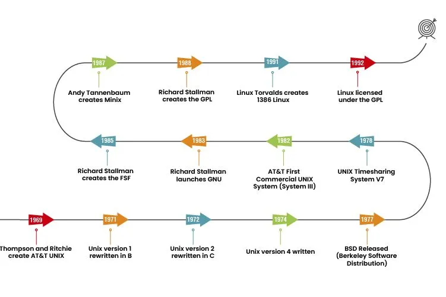

# Linux History

### A Concise History of Linux

---

### **1. Origins of Linux in UNIX**

Linux traces its roots to UNIX, a multiuser operating system developed at AT&T’s Bell Labs in the late 1960s. UNIX's portability and simplicity influenced modern operating systems but remained proprietary, inspiring efforts for free alternatives.

---

### **2. The GNU Project and Free Software**

In 1983, Richard Stallman launched the GNU Project to create a free UNIX-like OS, laying the foundation for free software. While GNU provided essential tools, it lacked a kernel to complete the operating system.

---

### **3. The Birth of Linux (1991)**

Linus Torvalds, a Finnish student, created Linux as a personal project while using the limited MINIX system. In August 1991, he announced Linux, a free kernel, and invited global contributions, kickstarting its rapid evolution.

---

### **4. Open Source Licensing and Community Growth**

In 1992, Linux adopted the GNU General Public License (GPL), allowing anyone to use, modify, and distribute it freely. This decision fostered a massive global community, accelerating development and adoption.

---

### **5. Linux Expands Beyond Academia**

By the mid-1990s, Linux gained traction in businesses for its reliability and low cost. Distributions like Debian, Red Hat, and Slackware made it accessible, while companies like IBM and HP supported its use.

---

### **6. Linux and the Open Source Movement**

In 1998, "open source" became a popular term, and Linux emerged as a flagship project, showcasing the power of community collaboration for producing robust software.

---

### **7. Linux in the 21st Century**

Linux powers servers, data centers, cloud platforms, IoT devices, and mobile phones (via Android). It’s a preferred OS for enterprises, supercomputers, and developers due to its efficiency and scalability.

---

### **8. Ongoing Development and Impact**

The Linux Foundation, established in 2000, supports Linux development and open-source collaboration. Linus Torvalds continues leading kernel development while Linux remains the backbone of modern computing.

---

### **Key Takeaways**

- Linux originated as a free alternative to UNIX, driven by open collaboration.
- Its adoption of the GPL license and community involvement were pivotal to its success.
- Today, Linux powers servers, cloud computing, Android devices, and supercomputers, embodying the success of open-source software.