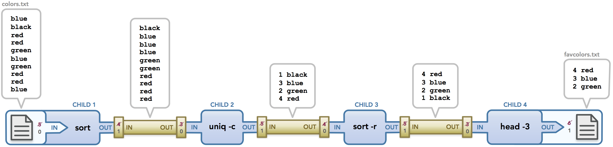

# Pipeline

https://www.freecodecamp.org/news/linux-terminal-piping-and-redirection-guide/




### **1. Introduction**

A **pipeline** in Linux allows the output of one command to become the input of another. This feature enables users to create efficient and powerful workflows by chaining commands together using the **pipe operator (`|`)**.

---

### **2. What is a Pipe?**

- A **pipe (`|`)** is used to connect commands.
- It takes the standard output (**stdout**) of one command and passes it as standard input (**stdin**) to another command.

**Syntax:**

```bash
command1 | command2 | command3

```

---

### **3. Why Use Pipelines?**

1. **Efficiency**: Combine multiple operations without creating intermediate files.
2. **Flexibility**: Create dynamic workflows by chaining commands.
3. **Real-Time Processing**: Process data streams on the fly.

---

### **4. Common Use Cases**

### **a) Filtering Output**

Use `grep` to search for specific patterns.

- Example: Find "error" in a log file:
    
    ```bash
    cat /var/log/syslog | grep "error"
    
    ```
    

### **b) Counting Lines, Words, or Characters**

Use `wc` to count lines, words, or characters.

- Example: Count the number of lines containing "error":
    
    ```bash
    cat /var/log/syslog | grep "error" | wc -l
    
    ```
    

### **c) Sorting Output**

Use `sort` to arrange lines in ascending or descending order.

- Example: Sort a list of filenames:
    
    ```bash
    ls | sort
    
    ```
    

### **d) Removing Duplicates**

Use `uniq` to eliminate duplicate lines.

- Example: Find unique entries in a list:
    
    ```bash
    cat names.txt | sort | uniq
    
    ```
    

### **e) Viewing Paginated Output**

Use `less` or `more` to paginate large outputs.

- Example: View a sorted list one screen at a time:
    
    ```bash
    ls | sort | less
    
    ```
    

---

### **5. Combining Multiple Commands**

Pipelines become powerful when chaining multiple commands together.

**Example: Process a Large Log File**

1. Extract lines with "error".
2. Sort the lines.
3. Count the unique occurrences.

```bash
cat /var/log/syslog | grep "error" | sort | uniq -c

```

**Explanation**:

- `cat /var/log/syslog`: Reads the file.
- `grep "error"`: Filters lines containing "error".
- `sort`: Sorts the lines.
- `uniq -c`: Counts unique occurrences.

---

### **6. Real-Time Pipelines**

### Monitoring Logs

Use `tail -f` to follow a log file and `grep` to filter in real time.

- Example: Monitor errors as they appear:
    
    ```bash
    tail -f /var/log/syslog | grep "error"
    
    ```
    

---

### **7. Advanced Examples**

### **Example 1: Extract Specific Columns**

Use `awk` or `cut` to extract specific fields from data.

- Example: Extract usernames from `/etc/passwd`:
    
    ```bash
    cat /etc/passwd | cut -d: -f1
    
    ```
    

### **Example 2: Find the Top Consumers of Disk Space**

1. List files in a directory with sizes.
2. Sort them by size.
3. Show the top 5.

```bash
du -h /var | sort -hr | head -n 5

```

**Explanation**:

- `du -h /var`: Display disk usage in human-readable format.
- `sort -hr`: Sort by size (descending).
- `head -n 5`: Show the top 5 results.

---

### **8. Practical Limitations of Pipes**

1. **Error Streams (`stderr`)**: Pipes only pass standard output (`stdout`). Errors (`stderr`) are not passed unless redirected.
    - Example: Redirect errors to standard output:
        
        ```bash
        command 2>&1 | another_command
        
        ```
        
2. **Chained Commands**: Overusing pipes can make commands harder to debug.

---

### **9. Hands-On Practice**

### **Task 1: Basic Piping**

1. Display the contents of `/etc/passwd` and filter lines containing "root":
    
    ```bash
    cat /etc/passwd | grep "root"
    
    ```
    
2. Count the number of lines containing "bin":
    
    ```bash
    cat /etc/passwd | grep "bin" | wc -l
    
    ```
    

---

### **Task 2: Chaining Commands**

1. List all files in `/var/log`, sort them alphabetically, and display the first 10:
    
    ```bash
    ls /var/log | sort | head -n 10
    
    ```
    
2. Extract IP addresses from a log file and count unique occurrences:
    
    ```bash
    cat logfile | grep -oE "\b[0-9]+\.[0-9]+\.[0-9]+\.[0-9]+\b" | sort | uniq -c
    
    ```
    

---

### **Task 3: Real-Time Processing**

1. Monitor a log file for the keyword "error":
    
    ```bash
    tail -f /var/log/syslog | grep "error"
    
    ```
    
2. Follow a log file and count updates in real time:
    
    ```bash
    tail -f logfile | wc -l
    
    ```
    

---

### **10. Quiz Questions**

1. What does the pipe operator (`|`) do in Linux?
2. Write a command to display the first 5 lines of a sorted list of files.
3. How can you count the number of unique words in a file using a pipeline?

---

### **11. Key Takeaways**

- Pipelines connect commands to create efficient workflows.
- Use `grep`, `wc`, `sort`, and `uniq` to manipulate and analyze data.
- Real-time pipelines are ideal for monitoring logs and processes.
- Practice chaining commands to build powerful pipelines for complex tasks.