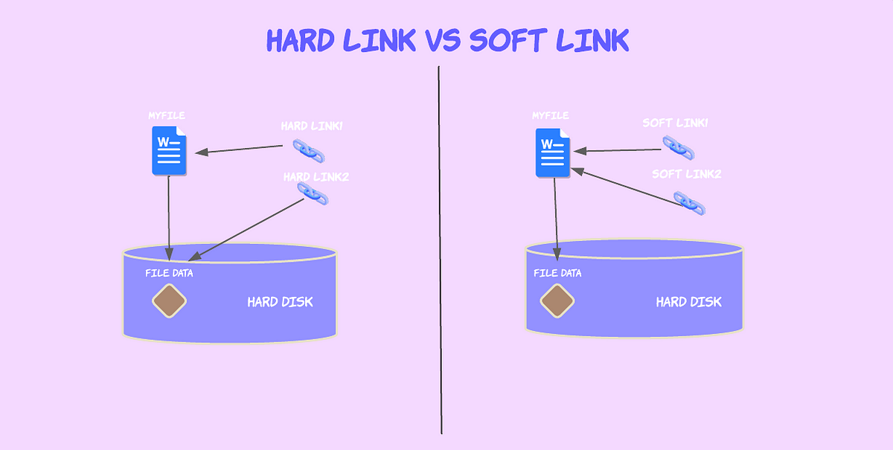

# Soft Links & Hard Links



### **1. Introduction**

In Linux, **links** are pointers or references to files. They allow multiple names or locations to access the same data. There are two main types of links:

1. **Hard Links**
2. **Soft Links (Symbolic Links)**

Understanding these links is important for managing files, conserving disk space, and creating shortcuts.

---

### **2. What is a Hard Link?**

A **hard link** is a direct reference to the data (inode) of a file.

- **Key Features:**
    1. It acts as an additional name for a file.
    2. All hard links to a file share the same inode.
    3. Deleting one hard link does not delete the actual file as long as other hard links exist.
    4. Hard links cannot span across different file systems or partitions.
- **Analogy**: Think of a hard link like two doors to the same room. No matter which door you use, you reach the same room.

---

### **Example: Hard Link**

1. Create a file:
    
    ```bash
    echo "Hello, Linux!" > original.txt
    
    ```
    
2. Check the inode of the file:
    
    ```bash
    ls -i original.txt
    
    ```
    
    Output: `12345 original.txt` (The inode number is `12345`).
    
3. Create a hard link:
    
    ```bash
    ln original.txt hardlink.txt
    
    ```
    
4. Verify both files share the same inode:
    
    ```bash
    ls -i
    
    ```
    
    Output:
    
    ```
    12345 original.txt
    12345 hardlink.txt
    
    ```
    
5. Test file behavior:
    - Modify `original.txt`:
        
        ```bash
        echo "Updated content" >> original.txt
        
        ```
        
    - Check `hardlink.txt`:Output: Contains the updated content.
        
        ```bash
        cat hardlink.txt
        
        ```
        
6. Delete `original.txt`:
    
    ```bash
    rm original.txt
    
    ```
    
    - `hardlink.txt` still works:Output: Still shows the file content.
        
        ```bash
        cat hardlink.txt
        
        ```
        

---

### **3. What is a Soft Link (Symbolic Link)?**

A **soft link** is a pointer to the file’s path, not the file itself. It creates a shortcut to the original file.

- **Key Features:**
    1. A soft link is a separate file with its own inode, pointing to the original file.
    2. If the original file is deleted, the soft link becomes broken (it points to nothing).
    3. Soft links can span across different file systems and partitions.
- **Analogy**: Think of a soft link like a bookmark pointing to a webpage. If the webpage is removed, the bookmark is useless.

---

### **Example: Soft Link**

1. Create a file:
    
    ```bash
    echo "Hello, Linux!" > original.txt
    
    ```
    
2. Create a soft link:
    
    ```bash
    ln -s original.txt softlink.txt
    
    ```
    
3. Verify the soft link:
    
    ```bash
    ls -l
    
    ```
    
    Output:
    
    ```sql
    lrwxrwxrwx 1 user group 12 Nov 19 12:00 softlink.txt -> original.txt
    
    ```
    
    - `l` at the start indicates a symbolic link.
    - `softlink.txt -> original.txt` shows the link points to `original.txt`.
4. Test file behavior:
    - Modify `original.txt`:
        
        ```bash
        echo "Updated content" >> original.txt
        
        ```
        
    - Check `softlink.txt`:Output: Contains the updated content.
        
        ```bash
        cat softlink.txt
        
        ```
        
5. Delete `original.txt`:
    
    ```bash
    rm original.txt
    
    ```
    
    - `softlink.txt` becomes broken:Output: `No such file or directory`.
        
        ```bash
        cat softlink.txt
        
        ```
        

---

### **4. Differences Between Hard Links and Soft Links**

| Feature | Hard Link | Soft Link (Symbolic Link) |
| --- | --- | --- |
| **Inode** | Shares the same inode as the original file. | Has its own inode, points to the file’s path. |
| **File Systems** | Must be on the same file system or partition. | Can cross file systems or partitions. |
| **File Deletion** | Original file remains accessible if one hard link exists. | Becomes broken if the original file is deleted. |
| **Usage** | Acts as a true copy of the file. | Acts as a shortcut to the file. |
| **Creation Command** | `ln` | `ln -s` |

---

### **5. Practical Use Cases**

1. **Hard Links**:
    - Use when you need multiple references to a file that must persist even if the original is deleted.
2. **Soft Links**:
    - Use for shortcuts or when files need to be referenced across different file systems.

---

### **6. Hands-On Practice for Students**

### Task 1: Create and Test Hard Links

1. Create a file `testfile.txt` and write some text to it.
2. Create a hard link called `hardlink_test.txt`.
3. Modify `testfile.txt` and check if `hardlink_test.txt` reflects the changes.
4. Delete `testfile.txt` and verify `hardlink_test.txt`.

### Task 2: Create and Test Soft Links

1. Create a file `softfile.txt` and write some text to it.
2. Create a soft link called `softlink_test.txt`.
3. Modify `softfile.txt` and check if `softlink_test.txt` reflects the changes.
4. Delete `softfile.txt` and observe what happens when you try to access `softlink_test.txt`.

---

### **7. Key Takeaways**

- Hard links share the same inode as the original file, making them robust but limited to the same file system.
- Soft links point to the file’s path, making them flexible but vulnerable to the deletion of the original file.
- Both links are powerful tools for managing files efficiently in Linux systems.